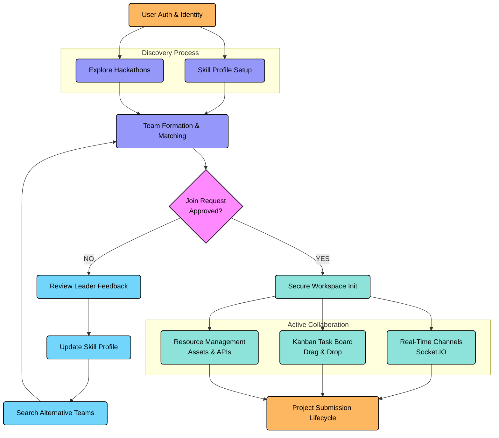

```mermaid
flowchart TD
    classDef orange fill:#fdb761,stroke:#000,stroke-width:1.5px,rx:5px,ry:5px,color:#000;
    classDef purple fill:#9598f8,stroke:#000,stroke-width:1.5px,rx:5px,ry:5px,color:#000;
    classDef pink fill:#ff8aff,stroke:#000,stroke-width:1.5px,color:#000;
    classDef blue fill:#72d6fc,stroke:#000,stroke-width:1.5px,rx:5px,ry:5px,color:#000;
    classDef teal fill:#8de2da,stroke:#000,stroke-width:1.5px,rx:5px,ry:5px,color:#000;

    %% Entry Point
    Ident[User Auth & Identity]:::orange
    
    %% Setup & Discovery (Horizontal branch)
    subgraph Discovery Process
    direction LR
      Profiles[Skill Profile Setup]:::purple
      Events[Explore Hackathons]:::purple
    end
    
    Ident --> Profiles
    Ident --> Events

    %% Team Management
    Team[Team Formation & Matching]:::purple
    Profiles --> Team
    Events --> Team

    %% Decision Node
    Approve{Join Request<br/>Approved?}:::pink
    Team --> Approve

    %% Rejection Loop (Horizontal loop to the side)
    Reject[Review Leader Feedback]:::blue
    Refine[Update Skill Profile]:::blue
    Browse[Search Alternative Teams]:::blue
    
    Approve -- NO --> Reject
    Reject --> Refine
    Refine --> Browse
    Browse --> Team

    %% Workspace Setup
    Init[Secure Workspace Init]:::teal
    Approve -- YES --> Init

    %% Detailed Workspace Features (Horizontal spread)
    subgraph Active Collaboration
    direction LR
      Chat[Real-Time Channels<br/>Socket.IO]:::teal
      Task[Kanban Task Board<br/>Drag & Drop]:::teal
      Docs[Resource Management<br/>Assets & APIs]:::teal
    end

    Init --> Chat
    Init --> Task
    Init --> Docs

    %% Finalize
    Finish[Project Submission Lifecycle]:::orange
    Chat --> Finish
    Task --> Finish
    Docs --> Finish
```
