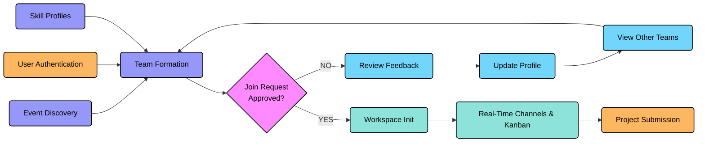

```mermaid
graph LR
    classDef orange fill:#fdb761,stroke:#000,stroke-width:1.5px,rx:5px,ry:5px,color:#000;
    classDef purple fill:#9598f8,stroke:#000,stroke-width:1.5px,rx:5px,ry:5px,color:#000;
    classDef pink fill:#ff8aff,stroke:#000,stroke-width:1.5px,color:#000;
    classDef blue fill:#72d6fc,stroke:#000,stroke-width:1.5px,rx:5px,ry:5px,color:#000;
    classDef teal fill:#8de2da,stroke:#000,stroke-width:1.5px,rx:5px,ry:5px,color:#000;

    Ident[User Authentication]:::orange
    Events[Event Discovery]:::purple
    Profiles[Skill Profiles]:::purple
    Team[Team Formation]:::purple
    
    Events --> Team
    Ident --> Team
    Profiles --> Team
    
    Approve{Join Request<br/>Approved?}:::pink
    
    Team --> Approve
    
    Reject[Review Feedback]:::blue
    Refine[Update Profile]:::blue
    Browse[View Other Teams]:::blue
    
    Approve -- NO --> Reject
    Reject --> Refine
    Refine --> Browse
    Browse --> Team
    
    Init[Workspace Init]:::teal
    Collab[Real-Time Channels & Kanban]:::teal
    Finish[Project Submission]:::orange
    
    Approve -- YES --> Init
    Init --> Collab
    Collab --> Finish
```
